## setting up the different servers 

installing necessary applications and dependencies on jenkins, nginx, database and tooling servers.

```
yum install -y https://dl.fedoraproject.org/pub/epel/epel-release-latest-8.noarch.rpm
yum install -y dnf-utils http://rpms.remirepo.net/enterprise/remi-release-8.rpm
yum install python3 python3-pip wget unzip git -y
python3 -m pip install --upgrade setuptools
python3 -m pip install --upgrade pip
python3 -m pip install PyMySQL
python3 -m pip install mysql-connector-python
python3 -m pip install psycopg2==2.7.5 --ignore-installed
```

```
Installing JAVA
====================================

sudo yum install java-11-openjdk-devel -y
open the bash profile
vi .bash_profile

paste the below in the bash profile
export JAVA_HOME=(dirname (readlink $(which javac))))) export PATH=$PATH:$JAVA_HOME/bin export CLASSPATH=.:$JAVA_HOME/jre/lib:$JAVA_HOME/lib:$JAVA_HOME/lib/tools.jar

reload the bash profile
source ~/.bash_profile
```
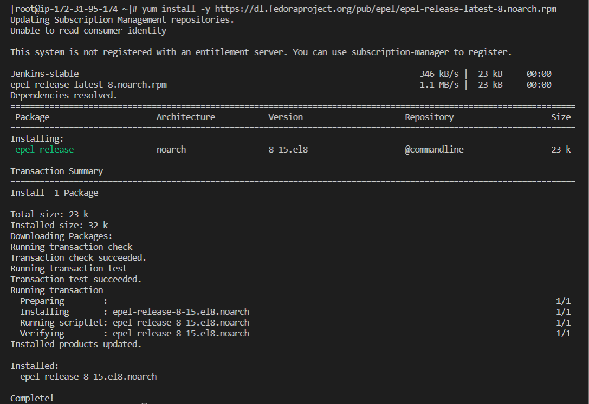

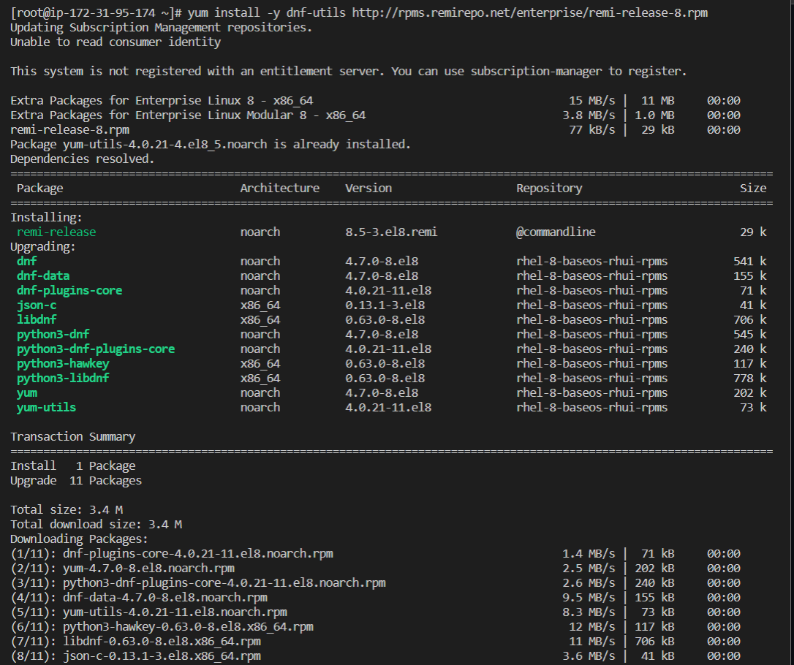

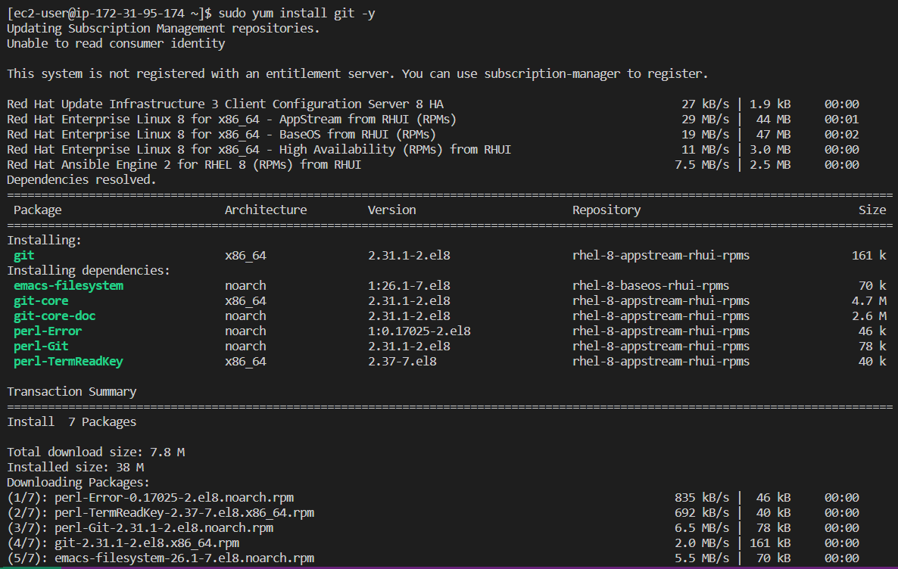

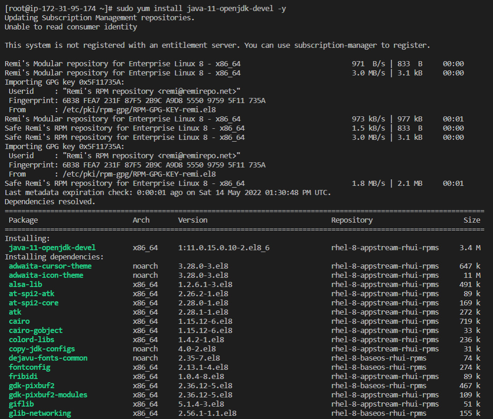

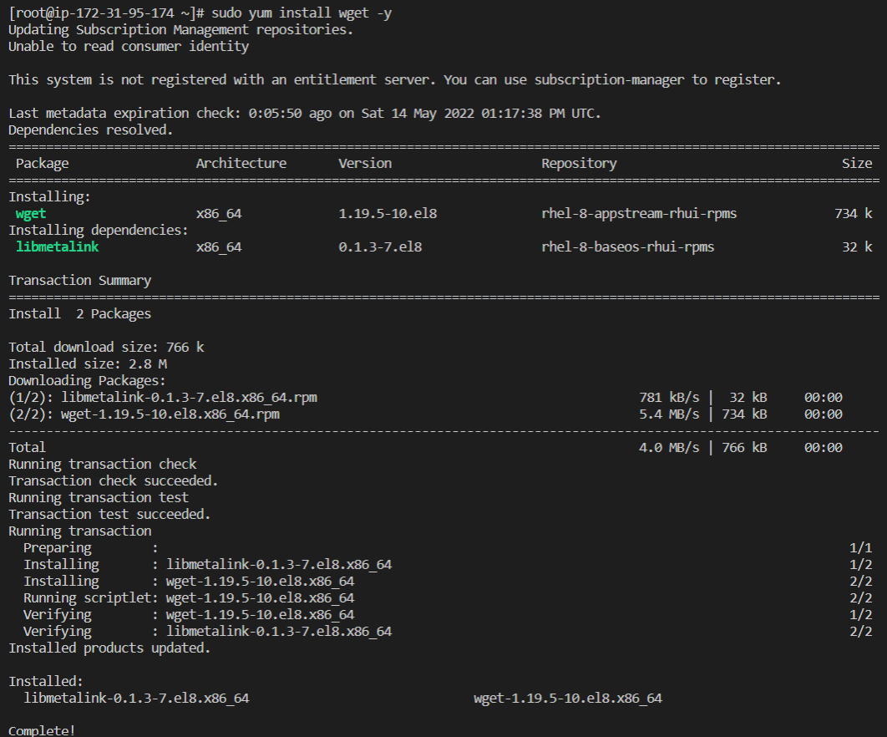


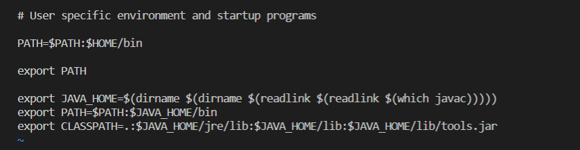

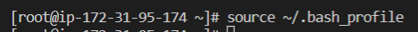

- installed jenkins and configured jenkins on the jenkins server

- installed and configured blue ocean on the server as well, connecting it to github so the builds can be automatically triggered

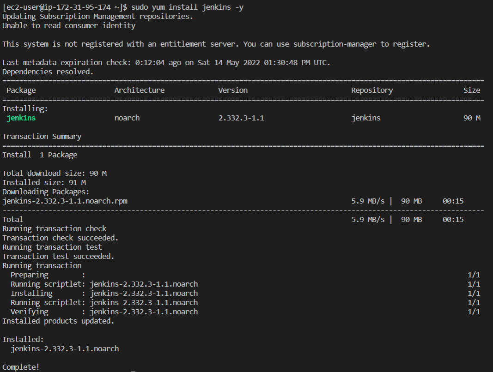

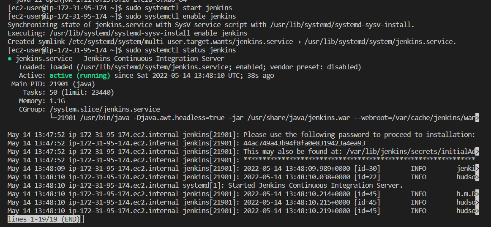

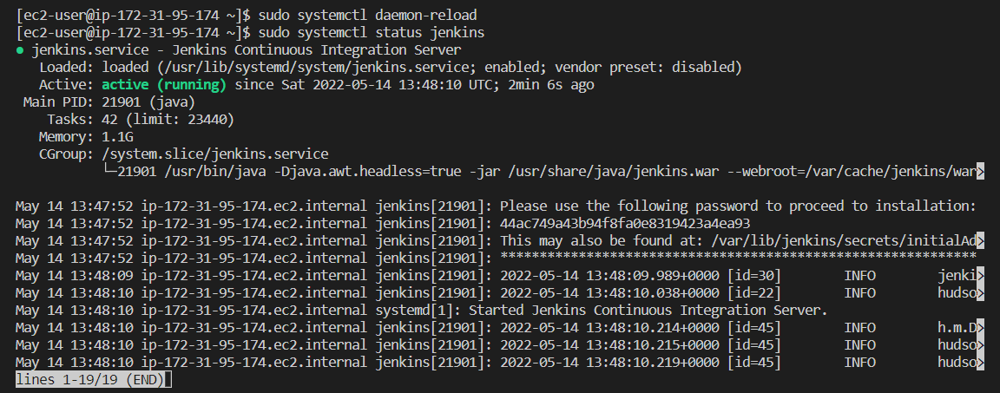

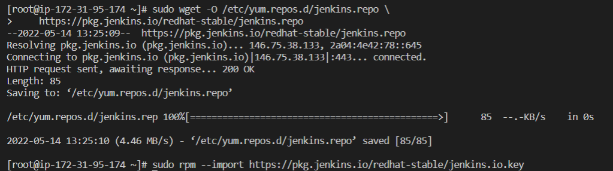

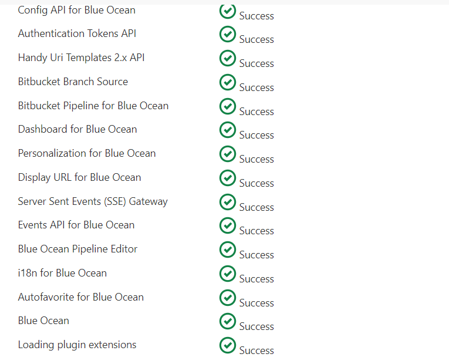

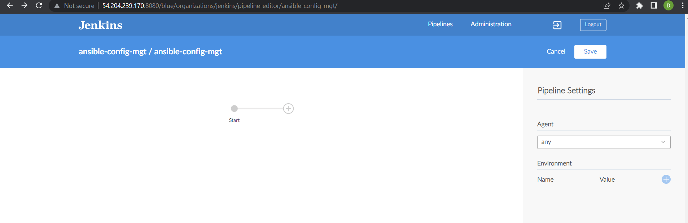

- created deploy directory in the repo and added started a new jenkinsfile in it