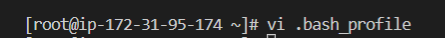

## setting up the different servers 

installing necessary applications and dependencies on jenkins, nginx, database and tooling servers.

```
yum install -y https://dl.fedoraproject.org/pub/epel/epel-release-latest-8.noarch.rpm
yum install -y dnf-utils http://rpms.remirepo.net/enterprise/remi-release-8.rpm
yum install python3 python3-pip wget unzip git -y
python3 -m pip install --upgrade setuptools
python3 -m pip install --upgrade pip
python3 -m pip install PyMySQL
python3 -m pip install mysql-connector-python
python3 -m pip install psycopg2==2.7.5 --ignore-installed
```

```
Installing JAVA
====================================

sudo yum install java-11-openjdk-devel -y
open the bash profile
vi .bash_profile

paste the below in the bash profile
export JAVA_HOME=(dirname (readlink $(which javac))))) export PATH=$PATH:$JAVA_HOME/bin export CLASSPATH=.:$JAVA_HOME/jre/lib:$JAVA_HOME/lib:$JAVA_HOME/lib/tools.jar

reload the bash profile
source ~/.bash_profile
```





- installed jenkins and configured jenkins on the jenkins server

- installed and configured blue ocean on the server as well, connecting it to github so the builds can be automatically triggered


- created deploy directory in the repo and added started a new jenkinsfile in it

- added some shell script to the file to trigger a build

```
pipeline {
    agent any

  stages {
    stage('Build') {
      steps {
        script {
          sh 'echo "Building Stage"'
        }
      }
    }
    }
}
```

- configured jenkins to access the location of the jenkins file 


- created a new git branch in the repo 

- added test stage script in jenkins file under the branch to trigger a build

- merged to test for the build under main 


```
 pipeline {
    agent any

  stages {
    stage('Build') {
      steps {
        script {
          sh 'echo "Building Stage"'
        }
      }
    }

    stage('Test') {
      steps {
        script {
          sh 'echo "Testing Stage"'
        }
      }
    }
    }
}
```


- created 3 new stages - package, deploy, clean up 

- ran the build on both feature and main branch

- confirmed on my machine that the build ran the task it was supposed to


### running ansible playbook from jenkins

- installed ansible and its dependencies on jenkins server

- installed ansible plugin on jenkins ui

- added new scripts to jenkinsfile

- updated ansible.cfg with the necessary configurations

- updated necessary environments in the inventory directory

- installed postgresql and nginx role from ansible galaxy

- edited the roles to suit my play

- updated the ansible playbooks/site.yml and staticassignments file

- made necessary configurations to allow smooth running on jenkins and ansible

- introduced parametization in jenkinsfile so the different env's can be executed without needing to manually change and update them

```
pipeline {
    agent any

    parameters {
      string(name: 'inventory', defaultValue: 'dev',  description: 'This is the inventory file for the environment to deploy configuration')
    }
...
```

- ran the play on both feature and main branch


### ci/cd pipeline for todo application

- cloned my php-todo.git repo

- installed php, its dependencies and composer tool on jenkins server

- installed ansible artifactory role

- installed plot pugin and artifactory plugin on jenkins ui

- configured artifactory on jenkins ui

- created new jenkins file on todo repo

- created multibranch pipeline on blue ocean

- created database and database user on db server

- updated database connectivity requirements

- updated jenkinsfile with pipeline config

```
pipeline {
    agent any

  stages {

     stage("Initial cleanup") {
          steps {
            dir("${WORKSPACE}") {
              deleteDir()
            }
          }
        }

    stage('Checkout SCM') {
      steps {
            git branch: 'main', url: 'https://github.com/darey-devops/php-todo.git'
      }
    }

    stage('Prepare Dependencies') {
      steps {
             sh 'mv .env.sample .env'
             sh 'composer install'
             sh 'php artisan migrate'
             sh 'php artisan db:seed'
             sh 'php artisan key:generate'
      }
    }
  }
}
```

- added unit test step to jenkinsfile

```
stage('Execute Unit Tests') {
      steps {
             sh './vendor/bin/phpunit'
      } 
```

- added code analysis step to jenkins file. output will be stored in build/logs/phploc.csv

```
stage('Code Analysis') {
  steps {
        sh 'phploc app/ --log-csv build/logs/phploc.csv'

  }
}
```

- added plot script to jenkins file

- bundled the application code into an artifact and uploaded it to artifactory

```
stage ('Package Artifact') {
    steps {
            sh 'zip -qr php-todo.zip ${WORKSPACE}/*'
     }
    }
```

- published the resulted artifact into artifactory

```
stage ('Upload Artifact to Artifactory') {
          steps {
            script { 
                 def server = Artifactory.server 'artifactory-server'                 
                 def uploadSpec = """{
                    "files": [
                      {
                       "pattern": "php-todo.zip",
                       "target": "<name-of-artifact-repository>/php-todo",
                       "props": "type=zip;status=ready"

                       }
                    ]
                 }""" 

                 server.upload spec: uploadSpec
               }
            }

        }
```

- deployed the application to the dev env by launching the ansible pipeline

```
stage ('Deploy to Dev Environment') {
    steps {
    build job: 'ansible-project/main', parameters: [[$class: 'StringParameterValue', name: 'env', value: 'dev']], propagate: false, wait: true
    }
  }
```


